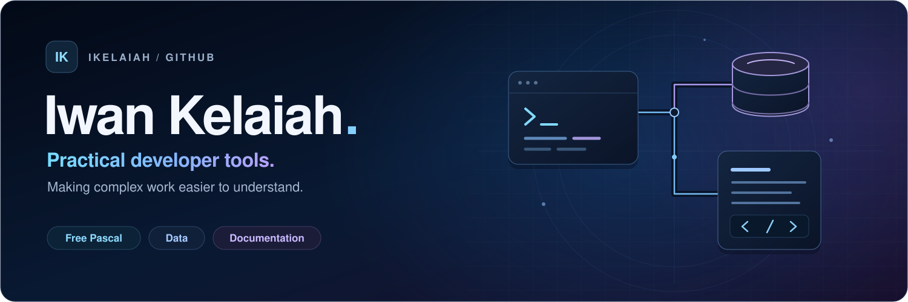

# Hi, I'm Iwan 👋

I build **practical developer tools** around **data, databases, documentation, and Free Pascal**.

I turn awkward problems — complicated SQL, repetitive tooling, numerical work, documentation — into software that's easier to understand and use. Also comfortable in **SQL, Python, and R**.

## 🌱 Currently building

**[SQL Cartographer](https://github.com/ikelaiah/sql-cartographer)** · **[DocSprout](https://github.com/ikelaiah/docsprout)** · **[mathlib-fp](https://github.com/ikelaiah/mathlib-fp)**

## ⭐ Featured

| Project | What it does |
| --- | --- |
| **[SQL Cartographer](https://github.com/ikelaiah/sql-cartographer)** | Paste SQL source, get a control-flow or query-lineage diagram. Runs entirely in the browser — no install, no database connection. |
| **[cli-fp](https://github.com/ikelaiah/cli-fp)** | A framework for building professional CLI apps in Free Pascal: hierarchical commands, rich help, and interactive prompts. |
| **[duckdb-fp](https://github.com/ikelaiah/duckdb-fp)** | A clean DuckDB wrapper with DataFrame-style results and CSV/Parquet round-tripping. |

## 📦 Free Pascal libraries

**Core** — [cli-fp](https://github.com/ikelaiah/cli-fp) · [duckdb-fp](https://github.com/ikelaiah/duckdb-fp) · [threadpool-fp](https://github.com/ikelaiah/threadpool-fp) · [threadsafecollections-fp](https://github.com/ikelaiah/threadsafecollections-fp)

**Utilities** — [toml-fp](https://github.com/ikelaiah/toml-fp) · [dotenv-fp](https://github.com/ikelaiah/dotenv-fp) · [simplejson-fp](https://github.com/ikelaiah/simplejson-fp) · [simplelog-fp](https://github.com/ikelaiah/simplelog-fp) · [chronokit-fp](https://github.com/ikelaiah/chronokit-fp) · [stringkit-fp](https://github.com/ikelaiah/stringkit-fp) · [request-fp](https://github.com/ikelaiah/request-fp)

## 📚 Writing & docs

**[Free Pascal Cookbook](https://github.com/ikelaiah/free-pascal-cookbook)** — practical, tested recipes for Object Pascal.

**[pasweave](https://github.com/ikelaiah/pasweave)** — a documentation generator for Free Pascal projects.

## 🤝 Reach me

Open to collaborating on Pascal tooling and data projects → **[LinkedIn](https://www.linkedin.com/in/ikelaiah/)**
