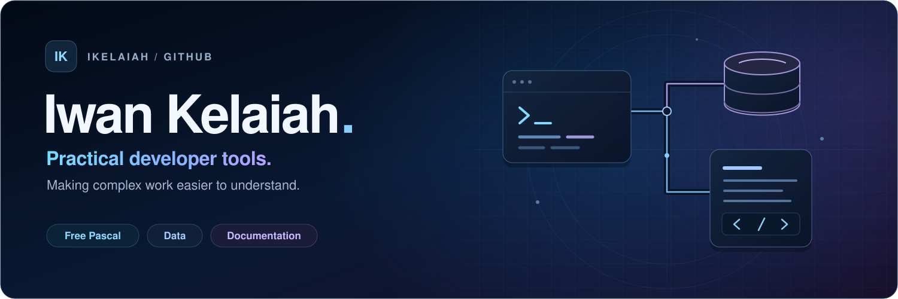

# Hi, I'm Iwan 👋

I build **pragmatic developer tools** that make complex systems easier to understand, maintain, and use — from enterprise integrations and SQL analysis to documentation and Free Pascal libraries.

I work with **Free Pascal, Python, SQL, R, and modern web technologies**.

## 🗺️ Currently building

**[Integration Atlas](https://github.com/ikelaiah/integration-atlas)** — Map dependencies across scripts, databases, files and APIs, with evidence-backed relationships and change-impact analysis. Local-first by design.

## 🛠️ Try my browser tools

No installation or account required. These tools process your inputs in the browser.

- **[SQL Cartographer](https://ikelaiah.github.io/sql-cartographer/)** — Explore SQL control flow, dependencies, lineage and ERDs.
- **[Git Map](https://ikelaiah.github.io/git-map/)** — Learn Git branching, merging and recovery in a visual sandbox.
- **[PromptCurtain](https://ikelaiah.github.io/prompt-curtain/)** — Mask sensitive details before sharing prompts with AI.
- **[First-Pass Triage](https://ikelaiah.github.io/first-pass-ticket-triage/)** — Get explainable P1–P4 suggestions for support tickets.
- **[Quiet Response](https://ikelaiah.github.io/quiet-response/)** — Generate custom QR codes privately.

## 📦 Free Pascal libraries

**Core & data** — [cli-fp](https://github.com/ikelaiah/cli-fp) · [duckdb-fp](https://github.com/ikelaiah/duckdb-fp) · [mathlib-fp](https://github.com/ikelaiah/mathlib-fp) · [threadpool-fp](https://github.com/ikelaiah/threadpool-fp) · [threadsafecollections-fp](https://github.com/ikelaiah/threadsafecollections-fp)

**Utilities** — [toml-fp](https://github.com/ikelaiah/toml-fp) · [dotenv-fp](https://github.com/ikelaiah/dotenv-fp) · [simplejson-fp](https://github.com/ikelaiah/simplejson-fp) · [simplelog-fp](https://github.com/ikelaiah/simplelog-fp) · [chronokit-fp](https://github.com/ikelaiah/chronokit-fp) · [stringkit-fp](https://github.com/ikelaiah/stringkit-fp) · [request-fp](https://github.com/ikelaiah/request-fp)

## 📚 Documentation & learning

**[DocSprout](https://github.com/ikelaiah/docsprout)** — Build polished documentation sites from Markdown.

**[PasWeave](https://github.com/ikelaiah/pasweave)** — Generate API documentation from Pascal source.

**[Free Pascal Cookbook](https://github.com/ikelaiah/free-pascal-cookbook)** — Learn Object Pascal through practical examples.

## 🤝 Connect

Open to collaborating on developer tools, data projects and Free Pascal → **[LinkedIn](https://www.linkedin.com/in/ikelaiah/)**
